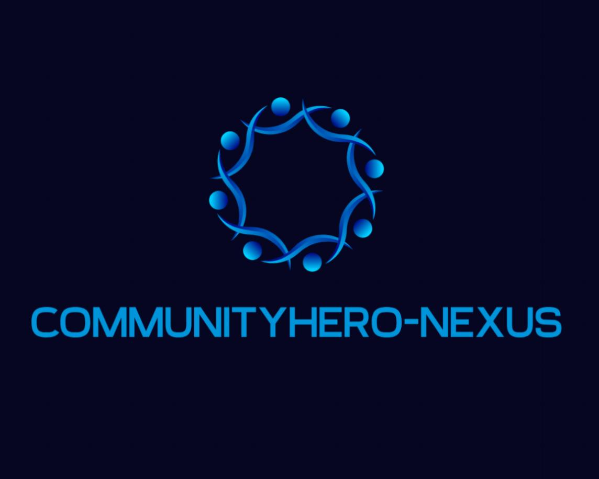
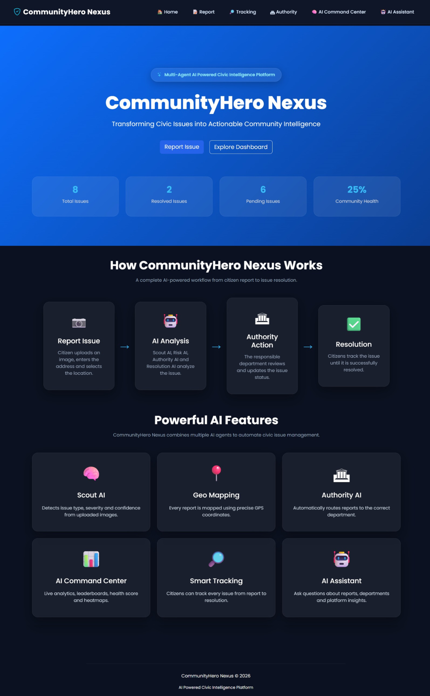
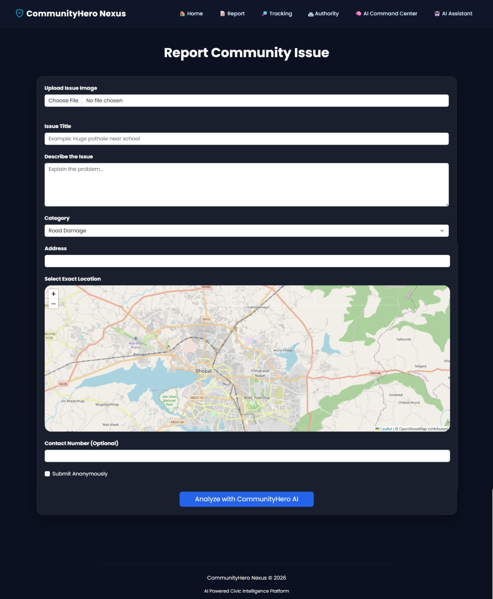
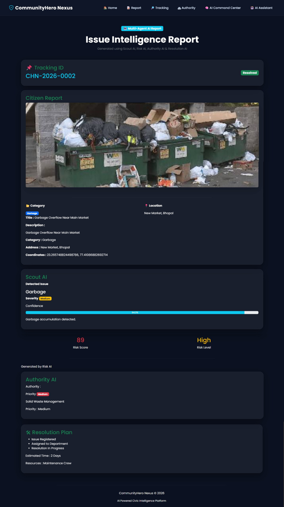
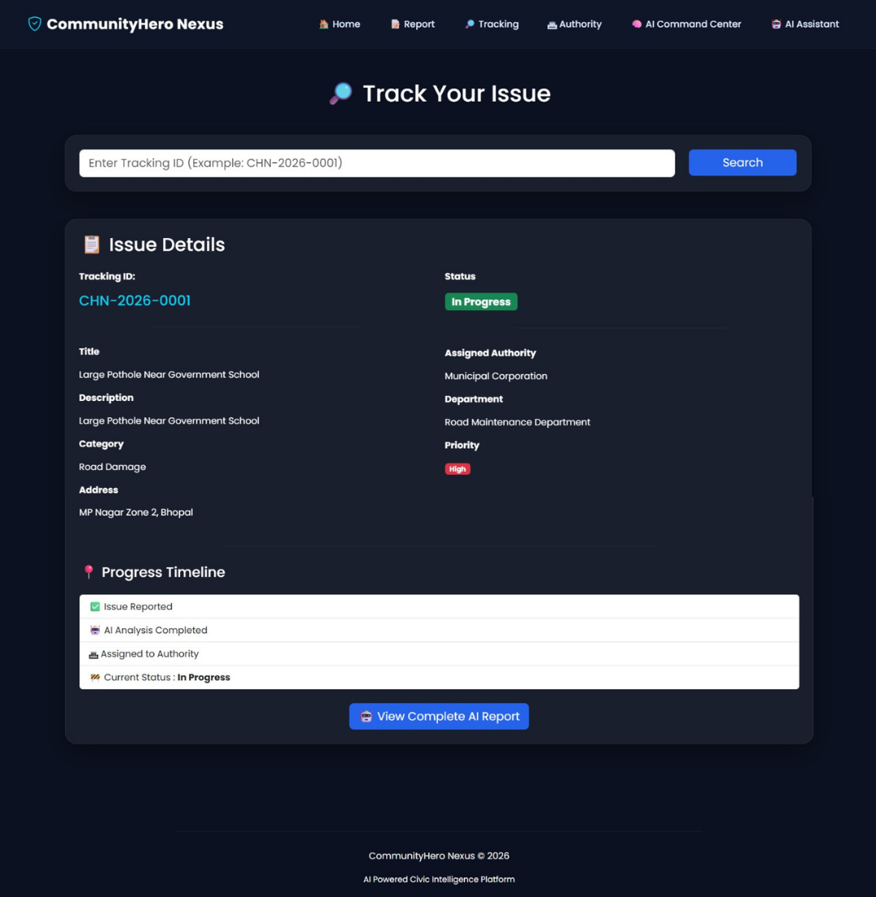
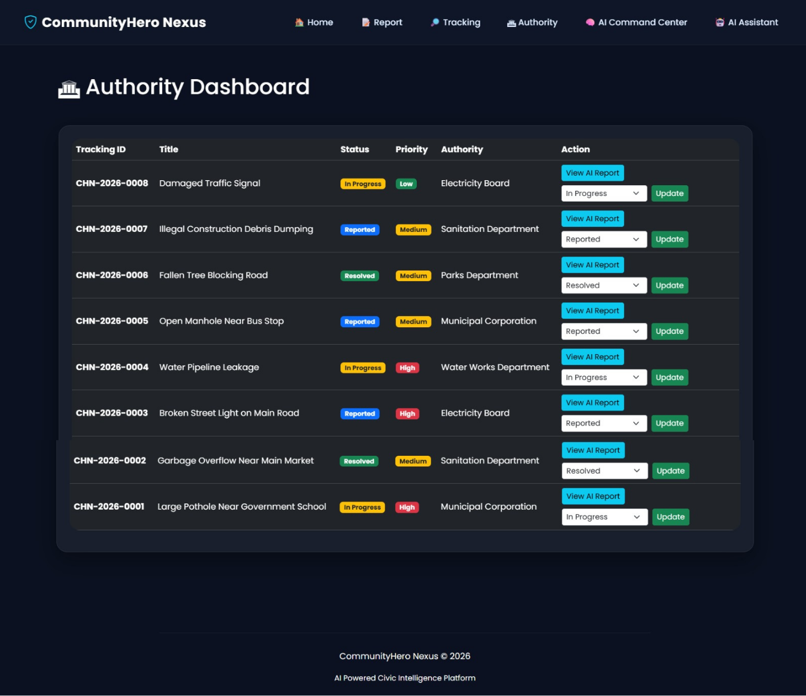
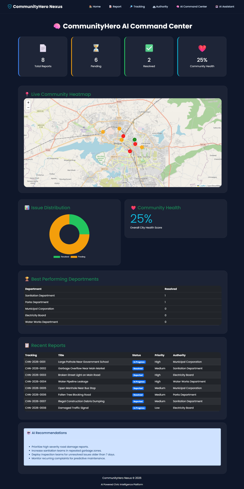
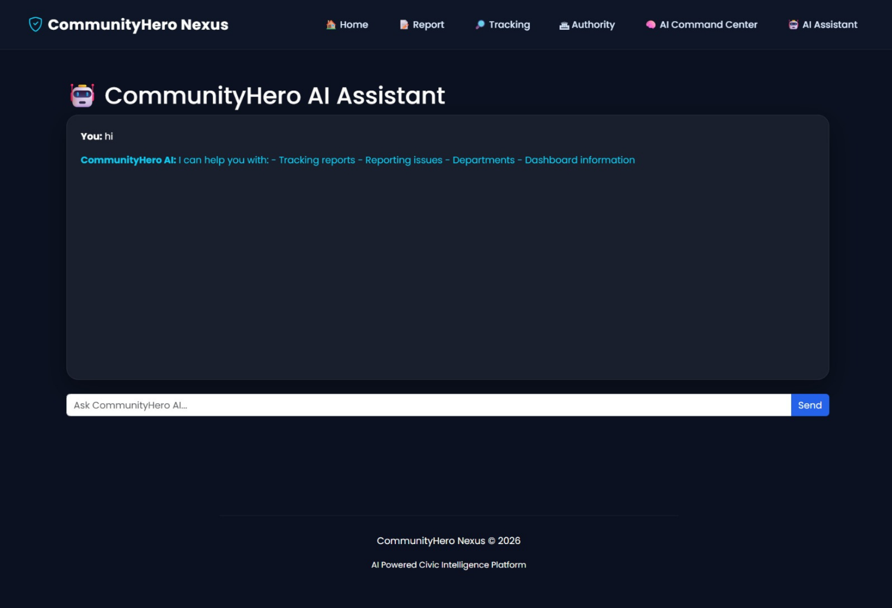
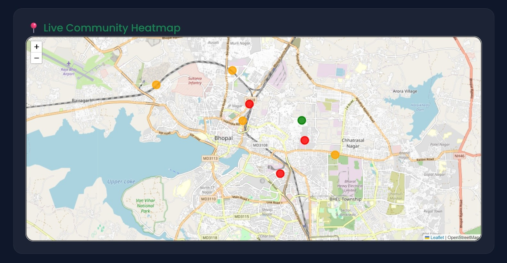

<p align="center">
    
</p>

<h1 align="center">
CommunityHero Nexus
</h1>

<h3 align="center">
AI-Powered Multi-Agent Civic Intelligence Platform
</h3>

<p align="center">
Transforming Citizen Reports into Intelligent Civic Action
</p>

<p align="center">


</p>

---

# 📖 Executive Summary

CommunityHero Nexus is an AI-powered civic intelligence platform designed to modernize how community infrastructure issues are reported, analyzed, prioritized, assigned, tracked, and resolved.

Traditional civic reporting systems often rely on fragmented workflows, manual categorization, delayed responses, and limited transparency. CommunityHero Nexus introduces an intelligent, modular workflow where specialized AI agents assist authorities throughout the lifecycle of an issue—from initial report to resolution.

Instead of functioning as a simple complaint portal, the platform combines AI-assisted decision support, geospatial mapping, analytics, and authority workflows into a unified civic intelligence ecosystem.

---

# 🌍 Problem Statement

Urban communities frequently encounter issues such as:

- Road damage and potholes
- Garbage accumulation
- Water leakages
- Broken street lights
- Drainage blockages
- Electrical infrastructure faults
- Public safety hazards

While many municipalities provide digital complaint portals, they often face several operational challenges:

- Manual issue categorization
- Incorrect department routing
- Limited tracking transparency
- Slow response workflows
- Lack of centralized analytics
- Minimal citizen engagement

These limitations increase response times and reduce public confidence in civic services.

---

# 💡 Our Solution

CommunityHero Nexus introduces a Multi-Agent AI workflow that assists both citizens and municipal authorities.

The platform enables citizens to submit community issues through an intuitive web interface while AI agents analyze the issue, estimate severity, determine the responsible authority, recommend an action plan, and maintain transparent tracking throughout the resolution process.

The result is a streamlined civic management platform that improves operational efficiency, transparency, and data-driven decision making.

---

# 🚀 Why CommunityHero Nexus?

Unlike traditional reporting portals that primarily collect complaints, CommunityHero Nexus focuses on the complete civic issue lifecycle.

### Key Differentiators

- 🧠 Multi-Agent AI Architecture
- 📍 Interactive Geospatial Mapping
- 🤖 AI-assisted Issue Analysis
- ⚠️ Automated Risk Assessment
- 🏛 Smart Authority Routing
- 🛠 Resolution Planning
- 📊 AI Command Center
- 🌍 Community Heatmap
- 📈 Community Health Score
- 🔎 Transparent Citizen Tracking

These capabilities transform the platform from a reporting portal into an intelligent civic management system.

---

# 📑 Table of Contents

- Overview
- Problem Statement
- Solution
- Key Features
- Multi-Agent AI Architecture
- System Workflow
- Screenshots
- Technology Stack
- Project Structure
- Installation
- Deployment
- Future Enhancements
- Acknowledgements
- License

---
# ✨ Core Features

CommunityHero Nexus combines AI-assisted civic issue management with analytics and authority workflows to create a unified platform for citizens and municipal authorities.

| Module | Description |
|---------|-------------|
| 📸 Smart Issue Reporting | Citizens can upload an issue image, provide details, choose a category, and mark the exact location using an interactive map. |
| 🤖 Scout AI | Performs the initial analysis of the reported issue and identifies its type, severity, confidence level, and summary. |
| ⚠️ Risk AI | Evaluates the urgency and potential public impact of the reported issue. |
| 🏛 Authority AI | Automatically recommends the responsible department and priority level. |
| 🛠 Resolution AI | Suggests a resolution strategy, required resources, and estimated completion time. |
| 🗺 Interactive Mapping | Uses Leaflet and OpenStreetMap for accurate location selection and visualization. |
| 🔎 Citizen Tracking | Citizens can track issue progress using a unique tracking ID. |
| 👨‍💼 Authority Dashboard | Authorities can review reports and update their current status. |
| 📊 AI Command Center | Displays city-wide analytics, issue distribution, community health, and operational insights. |
| 📈 Community Heatmap | Visualizes reported issue locations to identify high-density problem areas. |
| ❤️ Community Health Score | Calculates an overall indicator of civic infrastructure health. |
| 🏆 Department Leaderboard | Highlights departmental performance based on resolved issues. |
| 🤖 AI Assistant | Provides quick assistance and platform guidance. |

---

# 🧠 Multi-Agent AI Architecture

CommunityHero Nexus follows a modular Multi-Agent AI architecture where each AI agent has a dedicated responsibility instead of relying on a single generic AI response.

```text
Citizen Report
      │
      ▼
📸 Image + Details + Location
      │
      ▼
🧠 Scout AI
      │
      ▼
⚠️ Risk AI
      │
      ▼
🏛 Authority AI
      │
      ▼
🛠 Resolution AI
      │
      ▼
SQLite Database
      │
 ┌────┴────────────┐
 ▼                 ▼
Citizen        Authority
Tracking       Dashboard
        │
        ▼
 AI Command Center
```

### 🧠 Scout AI

Scout AI performs the initial assessment of the reported issue.

Responsibilities:

- Detect reported issue type
- Estimate severity
- Generate confidence score
- Produce AI summary

---

### ⚠️ Risk AI

Risk AI evaluates operational urgency.

Responsibilities:

- Risk assessment
- Risk score generation
- Public safety evaluation

---

### 🏛 Authority AI

Authority AI automatically determines which department should receive the report.

Responsibilities:

- Department routing
- Authority assignment
- Priority recommendation

---

### 🛠 Resolution AI

Resolution AI recommends a possible action plan.

Responsibilities:

- Resolution steps
- Resource estimation
- Estimated completion time

---

# 🚀 End-to-End Workflow

```text
Citizen
   │
   ▼
Report Community Issue
   │
   ▼
Upload Image
   │
   ▼
Provide Description
   │
   ▼
Select Category
   │
   ▼
Choose Map Location
   │
   ▼
Submit Report
   │
   ▼
Scout AI Analysis
   │
   ▼
Risk Evaluation
   │
   ▼
Authority Assignment
   │
   ▼
Resolution Planning
   │
   ▼
Issue Stored in Database
   │
   ▼
Citizen Tracking
   │
   ▼
Authority Dashboard
   │
   ▼
AI Command Center
```

---

# 🌟 Unique Selling Proposition (USP)

CommunityHero Nexus is designed as an **AI-powered civic intelligence platform**, not simply a complaint registration portal.

### Traditional Civic Portals

- Manual categorization
- Manual department assignment
- Limited tracking
- Static reporting
- Minimal analytics

### CommunityHero Nexus

- ✅ Multi-Agent AI workflow
- ✅ Intelligent issue analysis
- ✅ Automated authority routing
- ✅ Resolution recommendations
- ✅ Interactive GIS mapping
- ✅ Live tracking
- ✅ Community analytics
- ✅ AI Command Center
- ✅ Department performance insights

The platform focuses on assisting decision-making rather than simply collecting reports.

---

# 🎯 Project Highlights

- AI-assisted civic issue analysis
- Modular Multi-Agent workflow
- Interactive location mapping
- Real-time issue tracking
- Authority management portal
- AI analytics dashboard
- Community heatmap visualization
- Department performance monitoring
- Community health scoring
- Responsive web interface

---
# 📸 Application Preview

The following screenshots demonstrate the major workflows of CommunityHero Nexus.

---

## 🏠 Landing Page

The landing page introduces the platform, displays community statistics, and explains the AI-powered workflow.



---

## 📝 Community Issue Reporting

Citizens can upload an image, provide issue details, select a category, and mark the exact location using the interactive map.



---

## 🤖 AI Analysis Result

After submission, CommunityHero Nexus generates an AI-assisted analysis including:

- Scout AI
- Risk AI
- Authority AI
- Resolution AI
- Tracking ID



---

## 🔎 Citizen Tracking

Citizens can monitor the current status of their reported issue using the unique tracking ID.



---

## 🏛 Authority Dashboard

Authorities can review reports, inspect AI recommendations, and update the issue lifecycle.



---

## 🧠 AI Command Center

The command center provides a city-wide operational overview through analytics and visualizations.

Features include:

- Community Health Score
- Issue Distribution
- Heatmap
- Department Leaderboard
- Recent Reports
- AI Insights



---

## 🤖 AI Assistant

An integrated assistant provides guidance and quick information about the platform.



---

## 📍 Community Heatmap

Visualizes reported issue locations to help identify high-density civic problem areas.



---

# 🛠 Technology Stack

## Frontend

| Technology | Purpose |
|------------|---------|
| HTML5 | Structure |
| CSS3 | Styling |
| Bootstrap 5 | Responsive UI |
| JavaScript | Client-side functionality |
| Leaflet.js | Interactive maps |
| OpenStreetMap | Map tiles |

---

## Backend

| Technology | Purpose |
|------------|---------|
| Python | Programming language |
| Flask | Web framework |
| SQLAlchemy | ORM |
| SQLite | Database |
| Werkzeug | File uploads & utilities |

---

## AI Layer

| Component | Purpose |
|-----------|---------|
| Google AI Studio | AI development platform |
| Google Gemini | AI model integration (prototype support) |
| Scout AI | Initial issue analysis |
| Risk AI | Risk assessment |
| Authority AI | Department assignment |
| Resolution AI | Resolution planning |

---

## Deployment

| Platform | Purpose |
|----------|---------|
| Google Cloud Platform (GCP) | Application Hosting |
| Google AI Studio | AI workflow development |

---

# 📂 Project Structure

```text
CommunityHero-Nexus/
│
├── ai_agents/
│   ├── scout_ai.py
│   ├── risk_ai.py
│   ├── authority_ai.py
│   └── resolution_ai.py
│
├── database/
│   ├── database.py
│   └── models.py
│
├── routes/
│   ├── report_routes.py
│   ├── tracking_routes.py
│   ├── authority_routes.py
│   ├── dashboard_routes.py
│   └── assistant_routes.py
│
├── services/
│
├── static/
│   ├── css/
│   ├── js/
│   └── images/
│
├── templates/
│
├── uploads/
│
├── screenshots/
│
├── app.py
├── config.py
├── requirements.txt
└── README.md
```

---

# 📦 Major Modules

| Module | Responsibility |
|---------|----------------|
| Report Module | Citizen issue submission |
| Tracking Module | Status tracking |
| Authority Module | Issue management |
| Dashboard Module | Analytics |
| AI Assistant | User guidance |
| AI Agents | Decision support |
| Database Layer | Persistent storage |

---

# 🗄 Database Overview

The platform stores issue information in SQLite.

### Primary Entity

**Issue**

Fields include:

- Tracking ID
- Title
- Description
- Category
- Image Path
- Address
- Coordinates
- Severity
- Confidence
- AI Summary
- Risk Level
- Risk Score
- Assigned Authority
- Department
- Priority
- Estimated Resolution Time
- Required Resources
- Current Status

This information supports tracking, analytics, and authority workflows throughout the platform.

---
# 🚀 Getting Started

Follow the steps below to run CommunityHero Nexus locally.

---

## Prerequisites

Make sure the following software is installed:

- Python 3.10 or above
- Git
- pip
- Google AI Studio API Key (optional if AI integration is enabled)

---

## Installation

### 1. Clone the Repository

```bash
git clone https://github.com/<your-username>/CommunityHero-Nexus.git
```

### 2. Navigate into the Project

```bash
cd CommunityHero-Nexus
```

### 3. Create a Virtual Environment

Windows

```bash
python -m venv venv
venv\Scripts\activate
```

Linux / macOS

```bash
python3 -m venv venv
source venv/bin/activate
```

---

### 4. Install Dependencies

```bash
pip install -r requirements.txt
```

---

### 5. Configure Environment Variables (Optional)

Create a `.env` file in the project root.

Example:

```env
GEMINI_API_KEY=YOUR_API_KEY
SECRET_KEY=your_secret_key
```

---

### 6. Start the Application

```bash
python app.py
```

The application will be available at:

```
http://127.0.0.1:5000
```

---

# ☁️ Deployment

CommunityHero Nexus is designed to support deployment through **Google AI Studio** and **Google Cloud Platform (GCP)** as part of the hackathon workflow.

Deployment includes:

- AI Studio Build Mode
- Google Cloud Hosting
- Environment Variable Configuration
- Gemini API Integration
- Public Application URL

> Deployment configuration will depend on the target Google Cloud environment and project settings.

---

# 🔒 Security Considerations

The project follows several good practices:

- User uploads stored separately
- Environment variables used for secrets
- SQLAlchemy ORM for database interactions
- File upload sanitization using Werkzeug
- Modular application architecture

Future improvements include:

- User authentication
- Role-based authorization
- Cloud database
- Secure object storage
- HTTPS enforcement

---

# 📈 Future Enhancements

The current implementation demonstrates the core concept of an AI-assisted civic intelligence platform.

Potential future improvements include:

- Real-time notifications
- Mobile application
- GIS analytics
- AI-powered image segmentation
- Cloud database migration
- Citizen reward system
- Predictive maintenance analytics
- Role-based authentication
- Multi-language support
- Public API integration

---

# 🌍 Social Impact

CommunityHero Nexus was created to improve transparency and collaboration between citizens and local authorities.

The platform aims to:

- Improve issue reporting efficiency
- Reduce manual administrative effort
- Encourage citizen participation
- Support data-driven civic decision making
- Increase accountability through transparent tracking

Rather than replacing human decision-making, the platform provides AI-assisted recommendations to support faster and more informed actions.

---

# 🏆 Hackathon Alignment

This project was developed as a prototype demonstrating how AI can enhance civic issue management through intelligent automation.

Key areas include:

- AI-assisted issue analysis
- Modular multi-agent architecture
- Geospatial visualization
- Operational dashboards
- Authority workflow management
- Citizen transparency

---

# 🙏 Acknowledgements

CommunityHero Nexus was built using several excellent open-source technologies and developer tools.

Special thanks to:

- Google AI Studio
- Google Gemini
- Google Cloud Platform
- Flask
- SQLAlchemy
- SQLite
- Bootstrap
- Leaflet.js
- OpenStreetMap
- Werkzeug
- Python Software Foundation

Google AI Studio was used during solution development for AI-assisted design, prototyping, prompt engineering, UI iteration, and Gemini-powered workflows. The final application is implemented as a Flask-based full-stack web application.

Map tiles are provided by **OpenStreetMap contributors**.

---

# 📜 License

This project is released under the MIT License.

You are free to use, modify, and distribute this software in accordance with the terms of the license.

---

# 👨‍💻 Developer

**Prateek**

First-Year Computer Science Student

Passionate about AI, Full-Stack Development, and building practical technology solutions that create real-world impact.

---

# ⭐ Support the Project

If you found this project useful or interesting:

⭐ Star the repository

🍴 Fork the project

💡 Share your feedback

🤝 Contribute improvements

---

## 📚 Documentation

Additional documentation is available:

- 📦 INSTALLATION.md — Complete setup guide
- 🚀 README.md — Project overview

---

<p align="center">

<h2>CommunityHero Nexus</h2>

<b>AI-Powered Multi-Agent Civic Intelligence Platform</b>

<br><br>

Transforming Citizen Reports into Intelligent Civic Action

<br><br>

Built with ❤️ using Flask, Google AI Studio, Google Gemini, SQLite, Leaflet, Bootstrap, and Google Cloud Platform.

</p>
